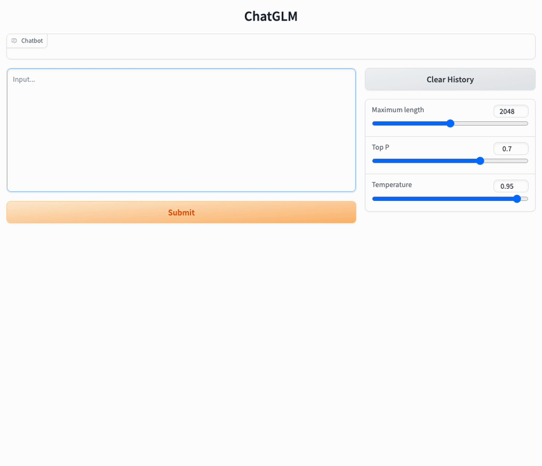
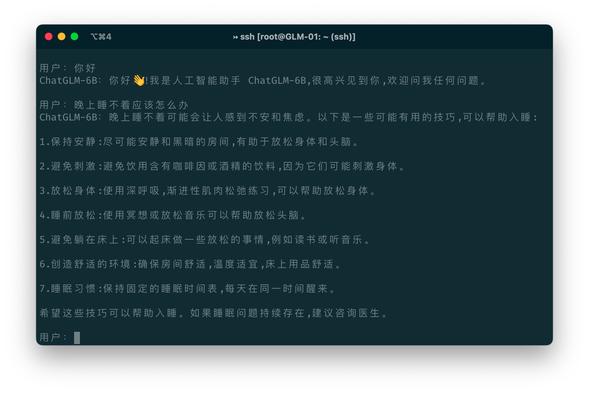

# ChatGLM3

<p align="center">
📄<a href="https://arxiv.org/pdf/2406.12793" target="_blank"> Report </a> • 🤗 <a href="https://huggingface.co/THUDM/chatglm3-6b" target="_blank">HF Repo</a> • 🤖 <a href="https://modelscope.cn/models/ZhipuAI/chatglm3-6b" target="_blank">ModelScope</a> • 🟣 <a href="https://www.wisemodel.cn/models/ZhipuAI/chatglm3-6b" target="_blank">WiseModel</a> • 📔 <a href="https://lslfd0slxc.feishu.cn/wiki/WvQbwIJ9tiPAxGk8ywDck6yfnof" target="_blank">Document</a> •  🧰 <a href="https://openxlab.org.cn/models/hot/THUDM" target="_blank">OpenXLab</a> • 🐦 <a href="https://twitter.com/thukeg" target="_blank">Twitter</a><br>
</p>
<p align="center">
    👋 加入我们的 <a href="https://discord.gg/fK2dz4bg" target="_blank">Discord</a> 和 <a href="resources/WECHAT.md" target="_blank">微信</a>
</p>
<p align="center">
📍在 <a href="https://www.chatglm.cn">chatglm.cn</a> 体验更大规模的 ChatGLM 模型。
</p>

[Read this in English.](./README_en.md)

📔 关于`ChatGLM3-6B` 更为详细的使用信息，可以参考

+ [ChatGLM3 开放技术文档](https://lslfd0slxc.feishu.cn/wiki/WvQbwIJ9tiPAxGk8ywDck6yfnof?from=from_copylink)
+ [Bilibili video](https://www.bilibili.com/video/BV1uC4y1J7yA)
+ [YouTube video](https://www.youtube.com/watch?v=Pw9PB6R7ORA)

## GLM-4 开源模型和API

我们已经发布最新的 **GLM-4** 模型，该模型在多个指标上有了新的突破，您可以在以下两个渠道体验我们的最新模型。

+ [GLM-4 开源模型](https://github.com/THUDM/GLM-4) 我们已经开源了 GLM-4-9B 系列模型，在各项指标的测试上有明显提升，欢迎尝试。
+ [智谱清言](https://chatglm.cn/main/detail?fr=ecology_x) 体验最新版 GLM-4，包括 **GLMs，All tools**等功能。
+ [API平台](https://open.bigmodel.cn/?utm_campaign=open&_channel_track_key=OWTVNma9) 新一代 API 平台已经上线，您可以直接在
  API
  平台上体验 `GLM-4-0520`、`GLM-4-air`、`GLM-4-airx`、`GLM-4-flash`、`GLM-4`、`GLM-3-Turbo`、`CharacterGLM-3`，`CogView-3`
  等新模型。
  其中`GLM-4`、`GLM-3-Turbo`两个模型支持了 `System Prompt`、`Function Call`、 `Retrieval`、`Web_Search`等新功能，欢迎体验。

+ [GLM-4 API 开源教程](https://github.com/MetaGLM/glm-cookbook/) GLM-4 API教程和基础应用，欢迎尝试。
  API相关问题可以在本开源教程疑问，或者使用 [GLM-4 API AI助手](https://open.bigmodel.cn/shareapp/v1/?share_code=sQwt5qyqYVaNh1O_87p8O)
  来获得常见问题的帮助。

-----

## ChatGLM3 介绍

**ChatGLM3** 是智谱AI和清华大学 KEG 实验室联合发布的对话预训练模型。ChatGLM3-6B 是 ChatGLM3
系列中的开源模型，在保留了前两代模型对话流畅、部署门槛低等众多优秀特性的基础上，ChatGLM3-6B 引入了如下特性：

1. **更强大的基础模型：** ChatGLM3-6B 的基础模型 ChatGLM3-6B-Base
   采用了更多样的训练数据、更充分的训练步数和更合理的训练策略。在语义、数学、推理、代码、知识等不同角度的数据集上测评显示，*
   *ChatGLM3-6B-Base 具有在 10B 以下的基础模型中最强的性能**。
2. **更完整的功能支持：** ChatGLM3-6B 采用了全新设计的 [Prompt 格式](PROMPT.md)
   ，除正常的多轮对话外。同时原生支持[工具调用](tools_using_demo/README.md)（Function Call）、代码执行（Code Interpreter）和
   Agent 任务等复杂场景。
3. **更全面的开源序列：** 除了对话模型 [ChatGLM3-6B](https://huggingface.co/THUDM/chatglm3-6b)
   外，还开源了基础模型 [ChatGLM3-6B-Base](https://huggingface.co/THUDM/chatglm3-6b-base)
   、长文本对话模型 [ChatGLM3-6B-32K](https://huggingface.co/THUDM/chatglm3-6b-32k)
   和进一步强化了对于长文本理解能力的 [ChatGLM3-6B-128K](https://huggingface.co/THUDM/chatglm3-6b-128k)。以上所有权重对学术研究**完全开放**
   ，在填写 [问卷](https://open.bigmodel.cn/mla/form) 进行登记后**亦允许免费商业使用**。

-----

ChatGLM3 开源模型旨在与开源社区一起推动大模型技术发展，恳请开发者和大家遵守 [开源协议](MODEL_LICENSE)
，勿将开源模型和代码及基于开源项目产生的衍生物用于任何可能给国家和社会带来危害的用途以及用于任何未经过安全评估和备案的服务。目前，本项目团队未基于
**ChatGLM3 开源模型**开发任何应用，包括网页端、安卓、苹果 iOS 及 Windows App 等应用。

尽管模型在训练的各个阶段都尽力确保数据的合规性和准确性，但由于 ChatGLM3-6B
模型规模较小，且模型受概率随机性因素影响，无法保证输出内容的准确。同时模型的输出容易被用户的输入误导。*
*本项目不承担开源模型和代码导致的数据安全、舆情风险或发生任何模型被误导、滥用、传播、不当利用而产生的风险和责任。**

## 模型列表
                      
|      Model       | Seq Length |                                                                                                                                              Download                                                                                                                                    |
|:----------------:|:----------:|:----------------------------------------------------------------------------------------------------------------------------------------------------------------------------------------------------------------------------------------------------------------------------------------:|
|   ChatGLM3-6B    |     8k     |        [HuggingFace](https://huggingface.co/THUDM/chatglm3-6b) \| [ModelScope](https://modelscope.cn/models/ZhipuAI/chatglm3-6b) \| [WiseModel](https://www.wisemodel.cn/models/ZhipuAI/chatglm3-6b)         \| [OpenXLab](https://openxlab.org.cn/models/detail/THUDM/chatglm3-6b)      |
| ChatGLM3-6B-Base |     8k     | [HuggingFace](https://huggingface.co/THUDM/chatglm3-6b-base) \| [ModelScope](https://modelscope.cn/models/ZhipuAI/chatglm3-6b-base) \| [WiseModel](https://www.wisemodel.cn/models/ZhipuAI/chatglm3-6b-base) \| [OpenXLabl](https://openxlab.org.cn/models/detail/THUDM/chatglm3-6b-base)|
| ChatGLM3-6B-32K  |    32k     |  [HuggingFace](https://huggingface.co/THUDM/chatglm3-6b-32k) \| [ModelScope](https://modelscope.cn/models/ZhipuAI/chatglm3-6b-32k) \| [WiseModel](https://www.wisemodel.cn/models/ZhipuAI/chatglm3-6b-32k)   \| [OpenXLab](https://openxlab.org.cn/models/detail/THUDM/chatglm3-6b-32k)  |
| ChatGLM3-6B-128K |    128k    |     [HuggingFace](https://huggingface.co/THUDM/chatglm3-6b-128k) ｜ [ModelScope](https://modelscope.cn/models/ZhipuAI/chatglm3-6b-128k)\| [OpenXLab](https://openxlab.org.cn/models/detail/THUDM/chatglm3-6b-128k) |

<br> 请注意，所有模型的最新更新都会在 Huggingface 率先发布。 ModelScope 和 WiseModel 由于没有与 Huggingface 同步，需要开发人员手动更新，可能会在
Huggingface 更新后一段时间内同步更新。

## 友情链接

以下优秀开源仓库已经对 ChatGLM3-6B 模型深度支持，欢迎大家扩展学习。

推理加速：

* [chatglm.cpp](https://github.com/li-plus/chatglm.cpp): 类似 llama.cpp 的量化加速推理方案，实现笔记本上实时对话
* [ChatGLM3-TPU](https://github.com/sophgo/ChatGLM3-TPU): 采用TPU加速推理方案，在算能端侧芯片BM1684X（16T@FP16，内存16G）上实时运行约7.5 token/s
* [TensorRT-LLM](https://github.com/NVIDIA/TensorRT-LLM/tree/main):
  NVIDIA开发的高性能 GPU 加速推理方案，可以参考此 [步骤](./tensorrt_llm_demo/README.md) 部署 ChatGLM3-6B 模型
* [OpenVINO](https://github.com/openvinotoolkit): 
Intel 开发的高性能 CPU 和 GPU 加速推理方案，可以参考此 [步骤](./Intel_device_demo/openvino_demo/README.md) 部署 ChatGLM3-6B 模型

高效微调：

* [LLaMA-Factory](https://github.com/hiyouga/LLaMA-Factory): 优秀易上手的高效微调框架。

应用框架：

* [LangChain-Chatchat](https://github.com/chatchat-space/Langchain-Chatchat): 基于 ChatGLM 等大语言模型与 Langchain
  等应用框架实现，开源、可离线部署的检索增强生成(RAG)大模型知识库项目。

* [BISHENG](https://github.com/dataelement/bisheng): 开源大模型应用开发平台,赋能和加速大模型应用开发落地，帮助用户以最佳体验进入下一代应用开发模式。

* [RAGFlow](https://github.com/infiniflow/ragflow): RAGFlow 是一款基于深度文档理解构建的开源 RAG（Retrieval-Augmented Generation）引擎。可为各种规模的企业及个人提供一套精简的 RAG 工作流程，结合大语言模型（LLM）针对用户各类不同的复杂格式数据提供可靠的问答以及有理有据的引用。

## 评测结果

### 典型任务

我们选取了 8 个中英文典型数据集，在 ChatGLM3-6B (base) 版本上进行了性能测试。

| Model            | GSM8K | MATH | BBH  | MMLU | C-Eval | CMMLU | MBPP | AGIEval |
|------------------|:-----:|:----:|:----:|:----:|:------:|:-----:|:----:|:-------:|
| ChatGLM2-6B-Base | 32.4  | 6.5  | 33.7 | 47.9 |  51.7  | 50.0  |  -   |    -    |
| Best Baseline    | 52.1  | 13.1 | 45.0 | 60.1 |  63.5  | 62.2  | 47.5 |  45.8   |
| ChatGLM3-6B-Base | 72.3  | 25.7 | 66.1 | 61.4 |  69.0  | 67.5  | 52.4 |  53.7   |

> Best Baseline 指的是截止 2023年10月27日、模型参数在 10B 以下、在对应数据集上表现最好的预训练模型，不包括只针对某一项任务训练而未保持通用能力的模型。

> 对 ChatGLM3-6B-Base 的测试中，BBH 采用 3-shot 测试，需要推理的 GSM8K、MATH 采用 0-shot CoT 测试，MBPP 采用 0-shot
> 生成后运行测例计算 Pass@1 ，其他选择题类型数据集均采用 0-shot 测试。

我们在多个长文本应用场景下对 ChatGLM3-6B-32K 进行了人工评估测试。与二代模型相比，其效果平均提升了超过
50%。在论文阅读、文档摘要和财报分析等应用中，这种提升尤为显著。此外，我们还在 LongBench 评测集上对模型进行了测试，具体结果如下表所示

| Model           |  平均  | Summary | Single-Doc QA | Multi-Doc QA | Code | Few-shot | Synthetic | 
|-----------------|:----:|:-------:|:-------------:|:------------:|:----:|:--------:|:---------:|
| ChatGLM2-6B-32K | 41.5 |  24.8   |     37.6      |     34.7     | 52.8 |   51.3   |   47.7    | 
| ChatGLM3-6B-32K | 50.2 |  26.6   |     45.8      |     46.1     | 56.2 |   61.2   |    65     |

## 使用方式

### 环境安装

首先需要下载本仓库：

```shell
git clone https://github.com/THUDM/ChatGLM3
cd ChatGLM3
```

然后使用 pip 安装依赖：

```
pip install -r requirements.txt
```

+ 为了保证 `torch` 的版本正确，请严格按照 [官方文档](https://pytorch.org/get-started/locally/) 的说明安装。

### 综合 Demo

我们提供了一个集成以下三种功能的综合 Demo，运行方法请参考[综合 Demo](composite_demo/README.md)

- Chat: 对话模式，在此模式下可以与模型进行对话。
- Tool: 工具模式，模型除了对话外，还可以通过工具进行其他操作。


- Code Interpreter: 代码解释器模式，模型可以在一个 Jupyter 环境中执行代码并获取结果，以完成复杂任务。


### 代码调用

可以通过如下代码调用 ChatGLM 模型来生成对话：

```
>> from transformers import AutoTokenizer, AutoModel
>> tokenizer = AutoTokenizer.from_pretrained("THUDM/chatglm3-6b", trust_remote_code=True)
>> model = AutoModel.from_pretrained("THUDM/chatglm3-6b", trust_remote_code=True, device='cuda')
>> model = model.eval()
>> response, history = model.chat(tokenizer, "你好", history=[])
>> print(response)

你好👋!我是人工智能助手 ChatGLM3 - 6B, 很高兴见到你, 欢迎问我任何问题。
>> response, history = model.chat(tokenizer, "晚上睡不着应该怎么办", history=history)
>> print(response)

晚上睡不着可能会让你感到焦虑或不舒服, 但以下是一些可以帮助你入睡的方法:

1.制定规律的睡眠时间表: 保持规律的睡眠时间表可以帮助你建立健康的睡眠习惯, 使你更容易入睡。尽量在每天的相同时间上床, 并在同一时间起床。
2.创造一个舒适的睡眠环境: 确保睡眠环境舒适, 安静, 黑暗且温度适宜。可以使用舒适的床上用品, 并保持房间通风。
3.放松身心: 在睡前做些放松的活动, 例如泡个热水澡, 听些轻柔的音乐, 阅读一些有趣的书籍等, 有助于缓解紧张和焦虑, 使你更容易入睡。
4.避免饮用含有咖啡因的饮料: 咖啡因是一种刺激性物质, 会影响你的睡眠质量。尽量避免在睡前饮用含有咖啡因的饮料, 例如咖啡, 茶和可乐。
5.避免在床上做与睡眠无关的事情: 在床上做些与睡眠无关的事情, 例如看电影, 玩游戏或工作等, 可能会干扰你的睡眠。
6.尝试呼吸技巧: 深呼吸是一种放松技巧, 可以帮助你缓解紧张和焦虑, 使你更容易入睡。试着慢慢吸气, 保持几秒钟, 然后缓慢呼气。

如果这些方法无法帮助你入睡, 你可以考虑咨询医生或睡眠专家, 寻求进一步的建议。
```

#### 从本地加载模型

以上代码会由 `transformers`
自动下载模型实现和参数。完整的模型实现在 [Hugging Face Hub](https://huggingface.co/THUDM/chatglm3-6b)
。如果你的网络环境较差，下载模型参数可能会花费较长时间甚至失败。此时可以先将模型下载到本地，然后从本地加载。

从 Hugging Face Hub
下载模型需要先[安装Git LFS](https://docs.github.com/zh/repositories/working-with-files/managing-large-files/installing-git-large-file-storage)
，然后运行

```Shell
git clone https://huggingface.co/THUDM/chatglm3-6b
```

如果从你从 HuggingFace 下载比较慢，也可以从 [ModelScope](https://modelscope.cn/models/ZhipuAI/chatglm3-6b)
中下载。

### 模型微调

我们提供了一个微调 ChatGLM3-6B 模型的基础套件，可以用来微调 ChatGLM3-6B 模型。微调套件的使用方法请参考
[微调套件](finetune_demo/README.md)。

### 网页版对话 Demo


可以通过以下命令启动基于 Gradio 的网页版 demo：

```shell
python web_demo_gradio.py
```


可以通过以下命令启动基于 Streamlit 的网页版 demo：

```shell
streamlit run web_demo_streamlit.py
```

网页版 demo 会运行一个 Web Server，并输出地址。在浏览器中打开输出的地址即可使用。 经测试，基于 Streamlit 的网页版 Demo 会更流畅。

### 命令行对话 Demo



运行仓库中 [cli_demo.py](basic_demo/cli_demo.py)：

```shell
python cli_demo.py
```

程序会在命令行中进行交互式的对话，在命令行中输入指示并回车即可生成回复，输入 `clear` 可以清空对话历史，输入 `stop` 终止程序。

### LangChain Demo

代码实现请参考 [LangChain Demo](langchain_demo/README.md)。

#### 工具调用

关于工具调用的方法请参考 [工具调用](tools_using_demo/README.md)。

#### OpenAI API / Zhipu API Demo

我们已经推出了 OpenAI / ZhipuAI 格式的 开源模型 API 部署代码，可以作为任意基于 ChatGPT 的应用的后端。
目前，可以通过运行仓库中的 [api_server.py](openai_api_demo/api_server.py) 进行部署

```shell
cd openai_api_demo
python api_server.py
```

同时，我们也书写了一个示例代码，用来测试API调用的性能。

+ OpenAI 测试脚本：[openai_api_request.py](openai_api_demo/openai_api_request.py)
+ ZhipuAI 测试脚本：[zhipu_api_request.py](openai_api_demo/zhipu_api_request.py)
+ 使用Curl进行测试
  
+ chat Curl 测试
```shell
curl -X POST "http://127.0.0.1:8000/v1/chat/completions" \
-H "Content-Type: application/json" \
-d "{\"model\": \"chatglm3-6b\", \"messages\": [{\"role\": \"system\", \"content\": \"You are ChatGLM3, a large language model trained by Zhipu.AI. Follow the user's instructions carefully. Respond using markdown.\"}, {\"role\": \"user\", \"content\": \"你好，给我讲一个故事，大概100字\"}], \"stream\": false, \"max_tokens\": 100, \"temperature\": 0.8, \"top_p\": 0.8}"
````

+ Standard openai interface agent-chat Curl 测试
```shell
curl -X POST "http://127.0.0.1:8000/v1/chat/completions" \
-H "Content-Type: application/json" \
-d "{\"model\": \"chatglm3-6b\", \"messages\": [{\"role\": \"user\", \"content\": \"37乘以8加7除2等于多少？\"}], "tools": [{"name": "track", "description": "追踪指定股票的实时价格",
          "parameters": {"type": "object", "properties": {"symbol": {"description": "需要追踪的股票代码"}},
                         "required": []}},
         {"name": "Calculator", "description": "数学计算器，计算数学问题",
          "parameters": {"type": "object", "properties": {"symbol": {"description": "要计算的数学公式"}},
                         "required": []}}
         ], \"stream\": true, \"max_tokens\": 100, \"temperature\": 0.8, \"top_p\": 0.8}"
````

+ Openai style custom interface agent-chat Curl 测试（你需要实现自定义的工具描述脚本openai_api_demo/tools/schema.py的内容，并且将api_server.py中AGENT_CONTROLLER指定为'true'）：
```shell
curl -X POST "http://127.0.0.1:8000/v1/chat/completions" \
-H "Content-Type: application/json" \
-d "{\"model\": \"chatglm3-6b\", \"messages\": [{\"role\": \"user\", \"content\": \"37乘以8加7除2等于多少？\"}], \"stream\": true, \"max_tokens\": 100, \"temperature\": 0.8, \"top_p\": 0.8}"
````
该接口用于openai风格的自定义工具箱的自主调度。具有调度异常的自处理回复能力，无需另外实现调度算法，用户无需api_key。


+ 使用Python进行测试

```shell
cd openai_api_demo
python openai_api_request.py
```

如果测试成功，则模型应该返回一段故事。

## 低成本部署

### 模型量化

默认情况下，模型以 FP16 精度加载，运行上述代码需要大概 13GB 显存。如果你的 GPU 显存有限，可以尝试以量化方式加载模型，使用方法如下：

```python
model = AutoModel.from_pretrained("THUDM/chatglm3-6b", trust_remote_code=True).quantize(4).cuda()
```

模型量化会带来一定的性能损失，经过测试，ChatGLM3-6B 在 4-bit 量化下仍然能够进行自然流畅的生成。

### CPU 部署

如果你没有 GPU 硬件的话，也可以在 CPU 上进行推理，但是推理速度会更慢。使用方法如下（需要大概 32GB 内存）

```python
model = AutoModel.from_pretrained("THUDM/chatglm3-6b", trust_remote_code=True).float()
```

### Mac 部署

对于搭载了 Apple Silicon 或者 AMD GPU 的 Mac，可以使用 MPS 后端来在 GPU 上运行 ChatGLM3-6B。需要参考 Apple
的 [官方说明](https://developer.apple.com/metal/pytorch) 安装 PyTorch-Nightly（正确的版本号应该是2.x.x.dev2023xxxx，而不是
2.x.x）。

目前在 MacOS 上只支持[从本地加载模型](README.md#从本地加载模型)。将代码中的模型加载改为从本地加载，并使用 mps 后端：

```python
model = AutoModel.from_pretrained("your local path", trust_remote_code=True).to('mps')
```

加载半精度的 ChatGLM3-6B 模型需要大概 13GB 内存。内存较小的机器（比如 16GB 内存的 MacBook
Pro），在空余内存不足的情况下会使用硬盘上的虚拟内存，导致推理速度严重变慢。

### 多卡部署

如果你有多张 GPU，但是每张 GPU 的显存大小都不足以容纳完整的模型，那么可以将模型切分在多张GPU上。首先安装
accelerate: `pip install accelerate`，然后即可正常加载模型。

### OpenVINO Demo

ChatGLM3-6B 已经支持使用 OpenVINO
工具包进行加速推理，在英特尔的GPU和GPU设备上有较大推理速度提升。具体使用方法请参考 [OpenVINO Demo](Intel_device_demo/openvino_demo/README.md)。

### TensorRT-LLM Demo

ChatGLM3-6B已经支持使用 TensorRT-LLM
工具包进行加速推理，模型推理速度得到多倍的提升。具体使用方法请参考 [TensorRT-LLM Demo](tensorrt_llm_demo/tensorrt_llm_cli_demo.py)
和 官方技术文档。

## 引用

如果你觉得我们的工作有帮助的话，请考虑引用下列论文。

```
@misc{glm2024chatglm,
      title={ChatGLM: A Family of Large Language Models from GLM-130B to GLM-4 All Tools}, 
      author={Team GLM and Aohan Zeng and Bin Xu and Bowen Wang and Chenhui Zhang and Da Yin and Diego Rojas and Guanyu Feng and Hanlin Zhao and Hanyu Lai and Hao Yu and Hongning Wang and Jiadai Sun and Jiajie Zhang and Jiale Cheng and Jiayi Gui and Jie Tang and Jing Zhang and Juanzi Li and Lei Zhao and Lindong Wu and Lucen Zhong and Mingdao Liu and Minlie Huang and Peng Zhang and Qinkai Zheng and Rui Lu and Shuaiqi Duan and Shudan Zhang and Shulin Cao and Shuxun Yang and Weng Lam Tam and Wenyi Zhao and Xiao Liu and Xiao Xia and Xiaohan Zhang and Xiaotao Gu and Xin Lv and Xinghan Liu and Xinyi Liu and Xinyue Yang and Xixuan Song and Xunkai Zhang and Yifan An and Yifan Xu and Yilin Niu and Yuantao Yang and Yueyan Li and Yushi Bai and Yuxiao Dong and Zehan Qi and Zhaoyu Wang and Zhen Yang and Zhengxiao Du and Zhenyu Hou and Zihan Wang},
      year={2024},
      eprint={2406.12793},
      archivePrefix={arXiv},
      primaryClass={id='cs.CL' full_name='Computation and Language' is_active=True alt_name='cmp-lg' in_archive='cs' is_general=False description='Covers natural language processing. Roughly includes material in ACM Subject Class I.2.7. Note that work on artificial languages (programming languages, logics, formal systems) that does not explicitly address natural-language issues broadly construed (natural-language processing, computational linguistics, speech, text retrieval, etc.) is not appropriate for this area.'}
}
```
